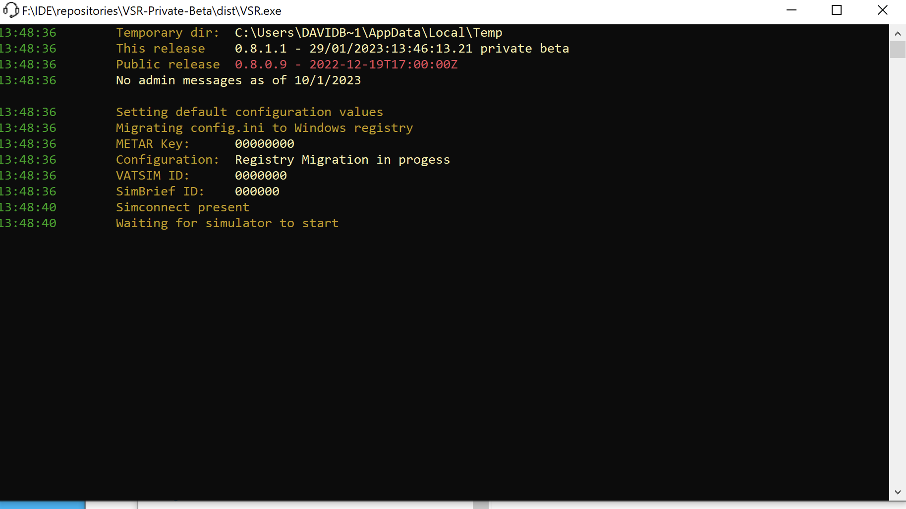
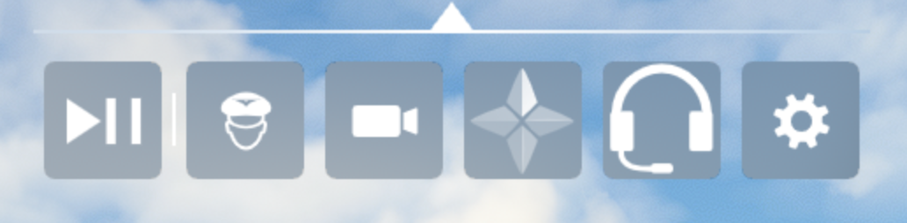

## Running the server
### Startup procedure

#### 1st time run or import

If you are running a release greater than 0.8.1.1 for the 1st time, then the server will initialise the configuration in the registry. 

If you ever need to edit the settings by hand then the registry path is:

` HKEY_CURRENT_USER\SOFTWARE\DeltaBravoZulu\VSR `

If you are upgrading from an earlier version, then the server will import your current settings into the registry.

#### Waiting for MSFS

Once the server has checked the registry, it will then wait for the simulator to start. It will then start 3 server processes:

 * The core webserver component on port 1228 (you can check on http://localhost:1228) - Please note that your initial location will be West Africa in the Atlantic at the Equator and Meridian 
 * The vPilot DLL connection for incoming VATSIM messages
 * The vPilot DLL connection for outgoing VATSIM messages

If you are running another copy of the server the servers will fail to load and advise you that there is another copy running. Close the duplicate server window.

Once the server has started, you can start a flight and load the toolbar app from the toolbar clicking the white headphone icon

