# VSR for VATSIM 

MSFS 2020 toolbar app for VATSIM

<a href="https://www.youtube.com/watch?v=Xp72yo8IUcY"  target="_blank"> 
Click to play promo video </a>

## Description

VSR is a toolbar app for Microsoft Flight Simulator 2020 that allows you to check which air traffic controllers are online when flying on the VATSIM Network. You can easily change to a frequency with a single click, or place a frequency on standby ready to change when requested to by ATC. The app also send & receives messages to and from the VATSIM network.

This app is not associated or endorsed by the VATSIM Network

### Features

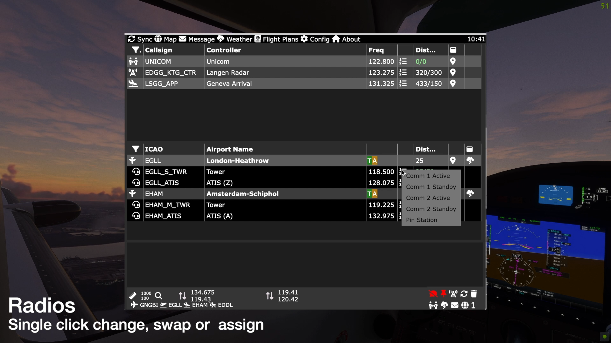</img>
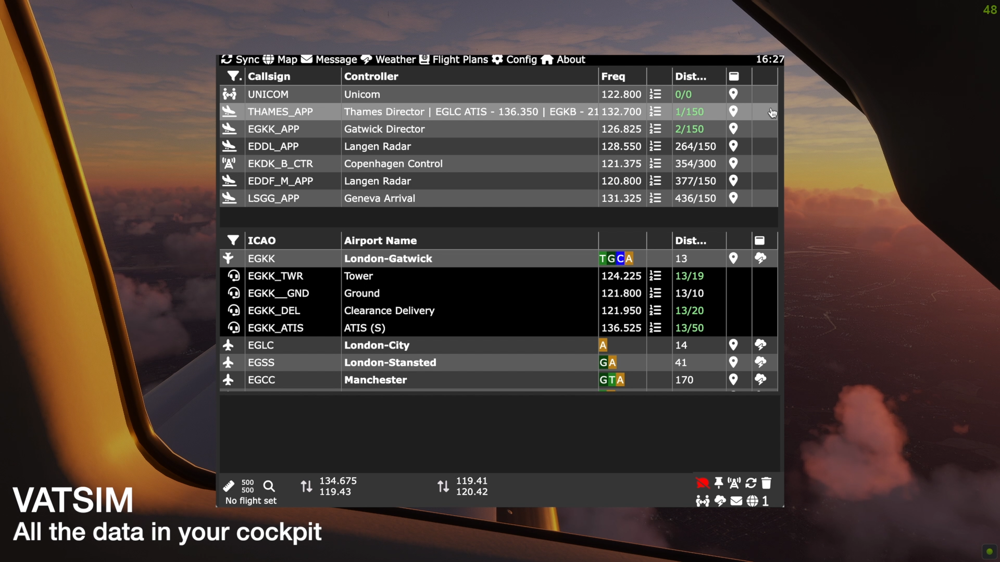</img>
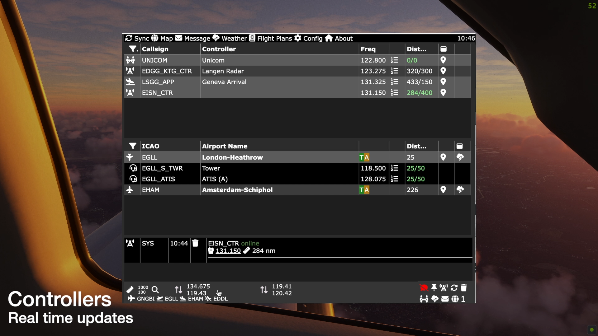</img>
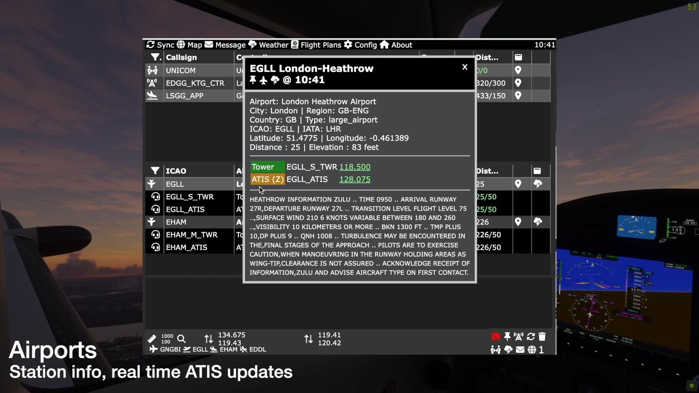</img>
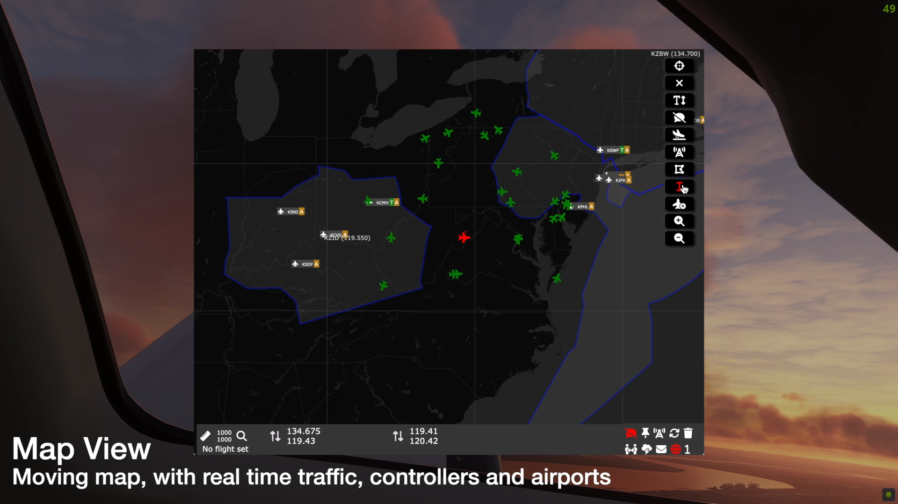</img>
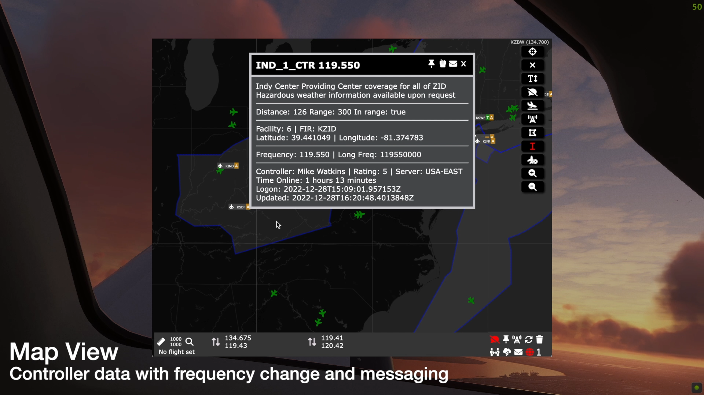</img>
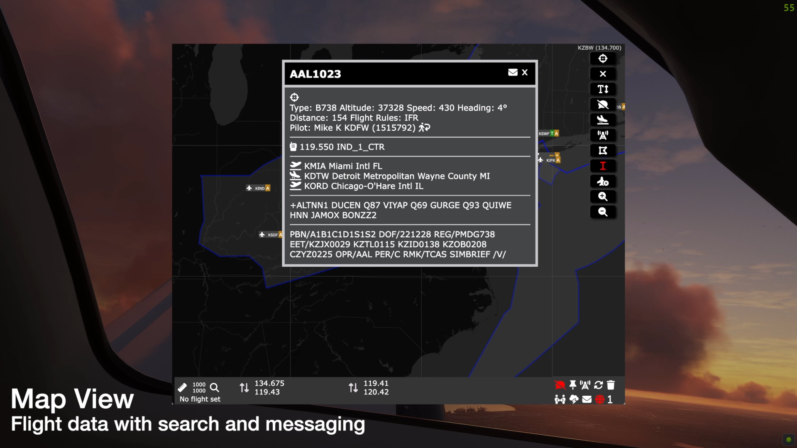</img>
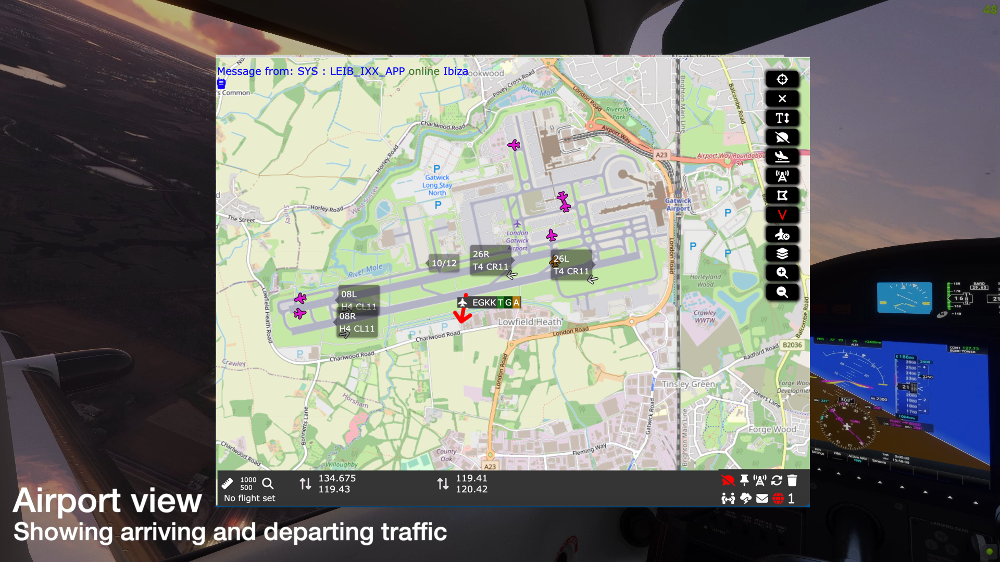</img>
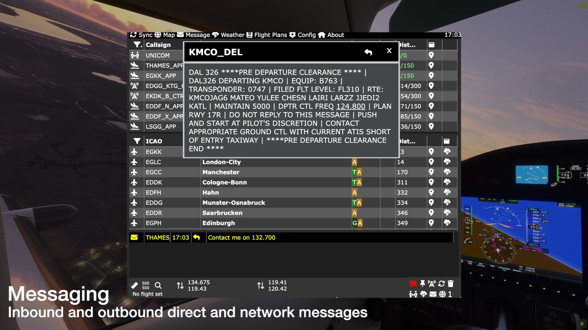</img>
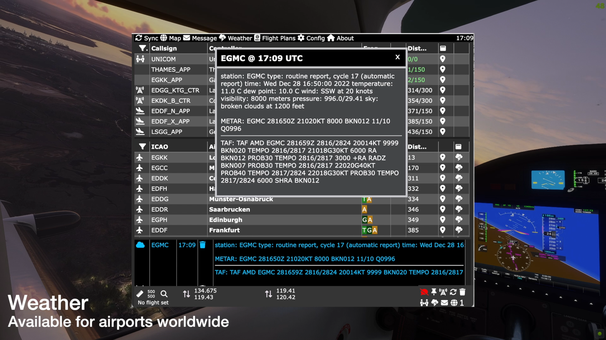</img>
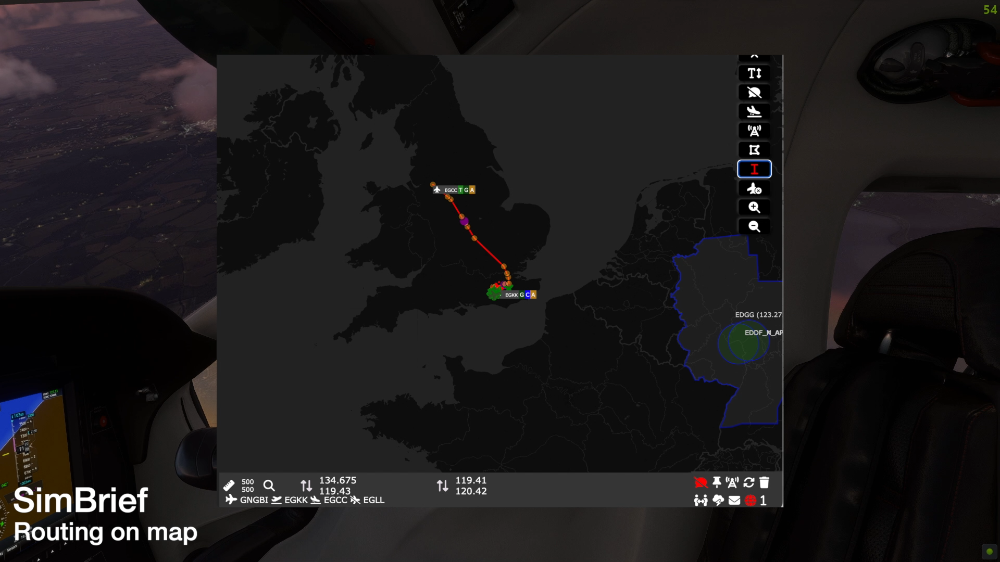</img>

## Getting Started

VSR consists of three components:

* A server that runs in the background, orchestrating data sources and messages.
* A toolbar app that installs in your community folder and runs in MSFS.
* A dynamic link library (DLL) that enables messaging between VATSIM and VSR.

An optional sound file can be installed under vPilot which makes it easier to hear incoming messages. <a href="https://youtu.be/JVm2Azv1CiQ" target="_blank">(preview)</a>

### Installation 

The install process can either be run through the installer programme, or manually. The installer will:

* Install latest release of the server
* Install latest release of the VSR Toolbar app
* Install latest release of the VSR/vPilot messaging DLL (and check it is installed correctly)
* Install new vPilot inbound message sounds 
* Enable configuration of the server with simBrief, VATSIM and CHECKWX data
* Create an optional desktop icon for the server 

<a href="https://www.youtube.com/watch?v=dQLiLrA36kM&list=PLPLro718J3Ka5t9TzFSH_9cL2-bKV70zh" target="_blank"> Installer Video </a>
  
### The VSR Zip file

Download the latest version from the <a href="https://github.com/daveblackuk/VSR/releases/tag/VSR" target="_blank">github repository</a>

Unzip the file; the directory structure should be as follows:

You can either run the installer, or install manually.

### Automatic installer
#### Installation process

The installer will undertake a number of checks as it proceeds:

* Check the MSFS community folder, it will vary based upon whether MSFS was installed:
   * Via MS Store  
   * Via Steam
   * Via a physical disk
   * Manually 
* Check the versions of the downloaded components
* Check whether you wish to continue or install manually
* Ask you where you wish to install the toolbar app component
  
   The default location is the detected community folder; however you may
   wish to install it elsewhere, for instance if you are using an add-on linker.
   If you answer n then you will need to select a folder manually.

* Ask you where you wish to install the server component. 

   By default this is under the toolbar folder; hwoever you may wish to install it elsewhere. If you answer n then you will need to select a folder manually.

* Check whether an existing configuration exists in the selected server location
* Copy the toolbar app to the selected folder.
* Copy the VSR server to the selected folder.
* Ask you whether you want the new VSR message sound for vPilot installed <a href="https://youtu.be/JVm2Azv1CiQ" target="_blank">(preview)</a>
  
   If you answer yes, then the installer will backup two existing files into a backup directory under vPilot/sounds and copy over the new files.

* Ask you if you wish to create a desktop shortcut to the VSR Server.
* Start vPilot and wait for an incoming message to ensure the DLL is working correctly.
  
* If there are issues, please read the DLL section (below)

#### Virus warnings

### Manual installation
#### Directories
#### File permissions
### The VSR vPilot DLL

If messaging is not functioning, then please check:

  * vPilot is installed in the default location 
  * The DLL was copied in the plugins folder under the main vPilot installation directory
  * the DLL has the correct security permissions set

### vPilot Sound file

### The Metar key
#### Why do you need a key?
#### Obtaining free key
#### Configuring the key in VSR

### Your vPilot CID
#### Why do you need it?
#### Configuring the vPilot CID in VSR

### Your SimBrief ID
#### Why do you need it?
#### Where to find your SimBrief ID
#### Configuring the SimBrief ID in VSR

## Running the server
### Startup procedure
## Troubleshooting
### Known issues
### How to debug
## FAQs

## Screenshots
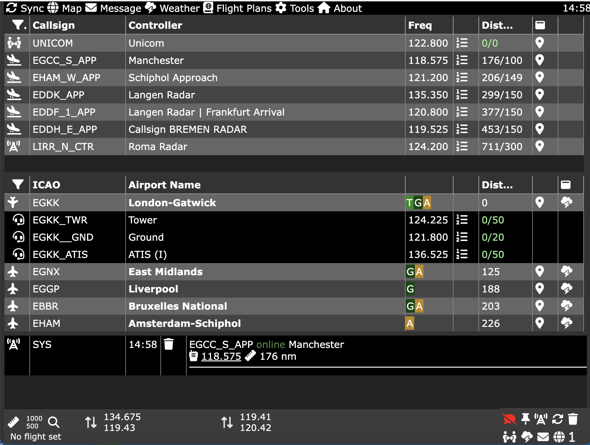

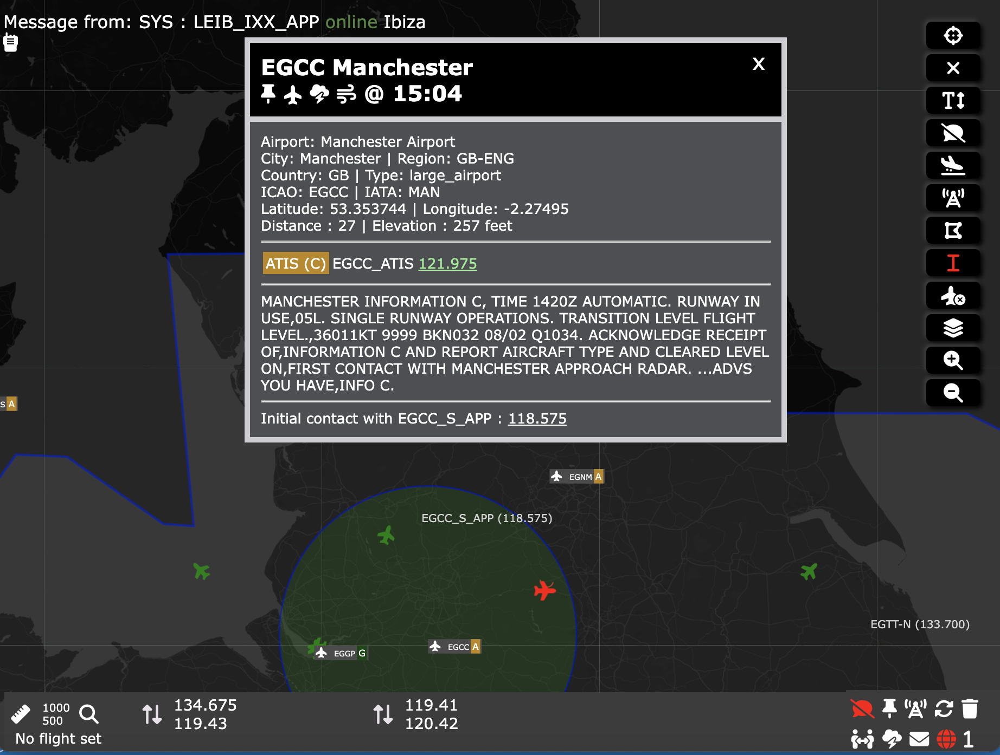

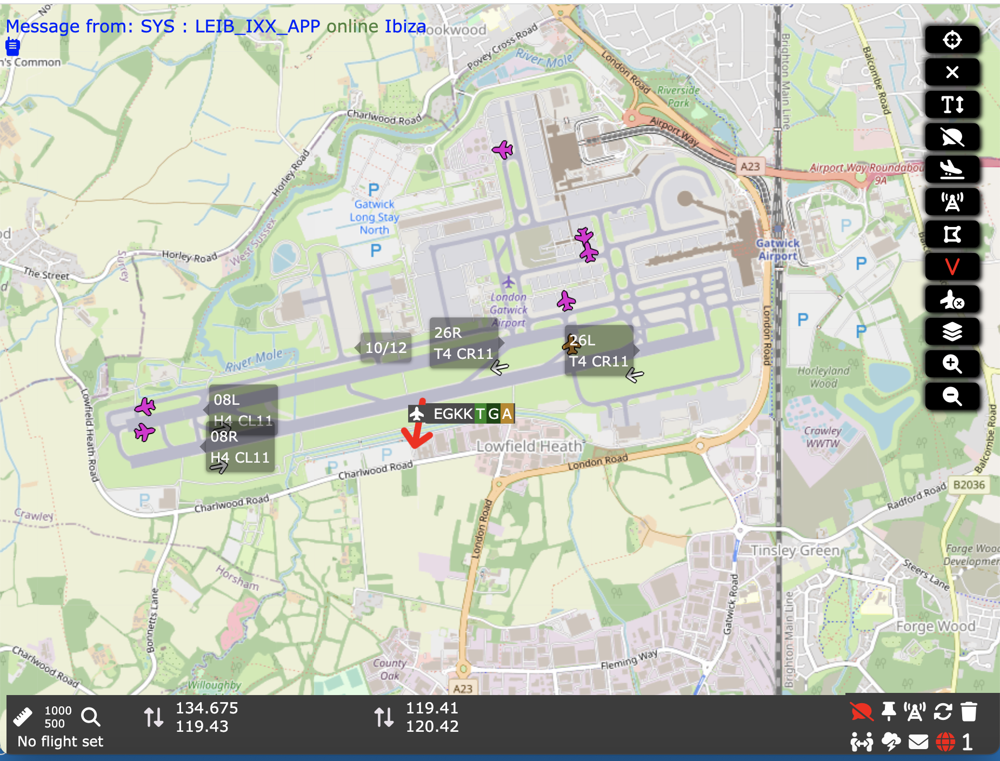
s
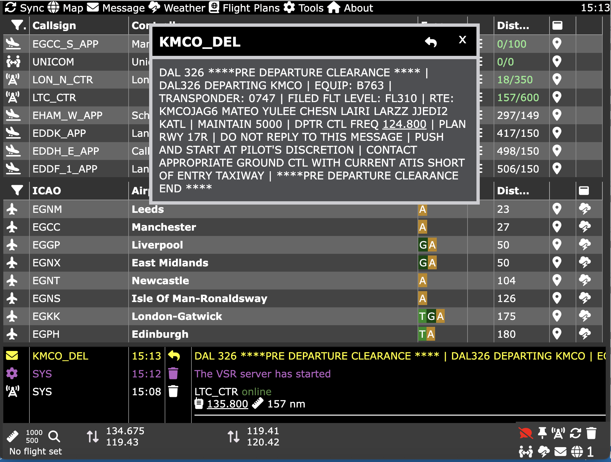
