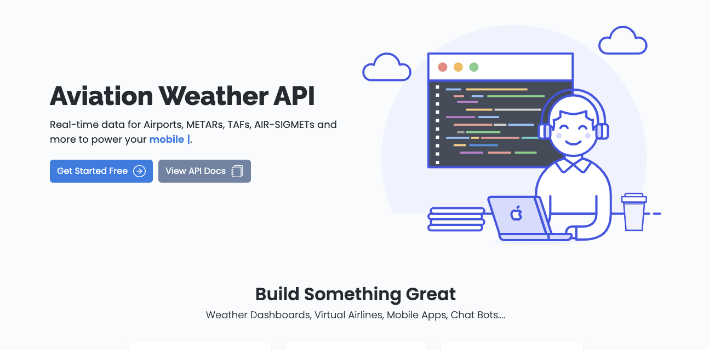
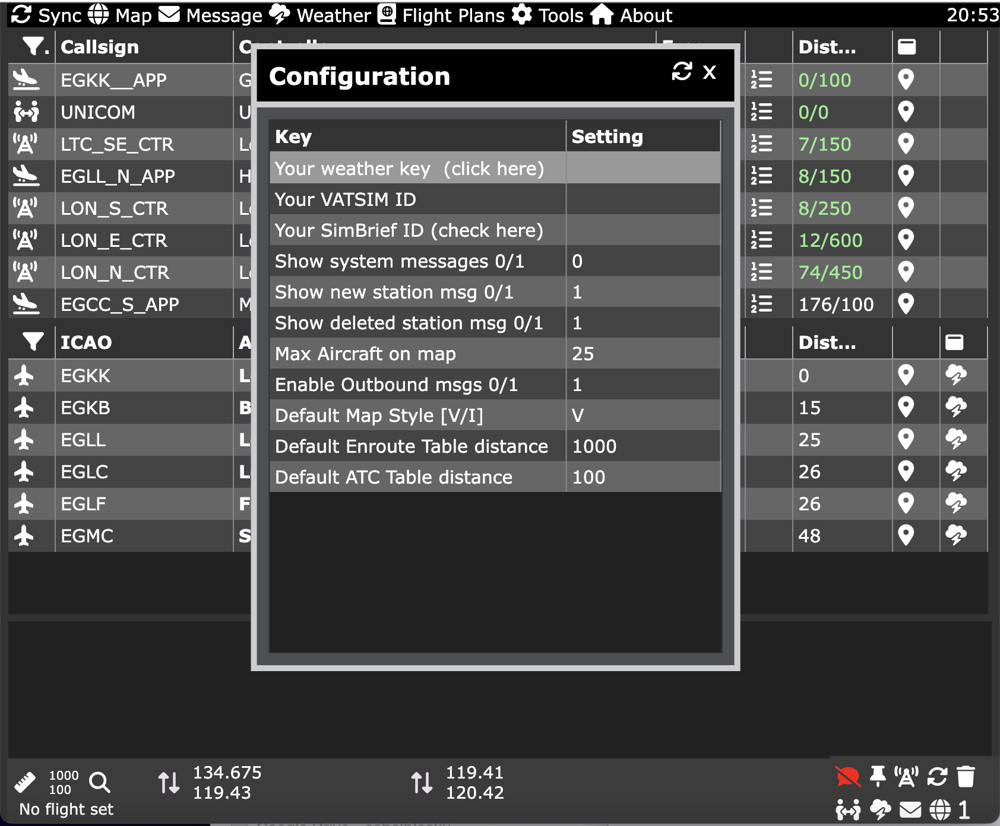
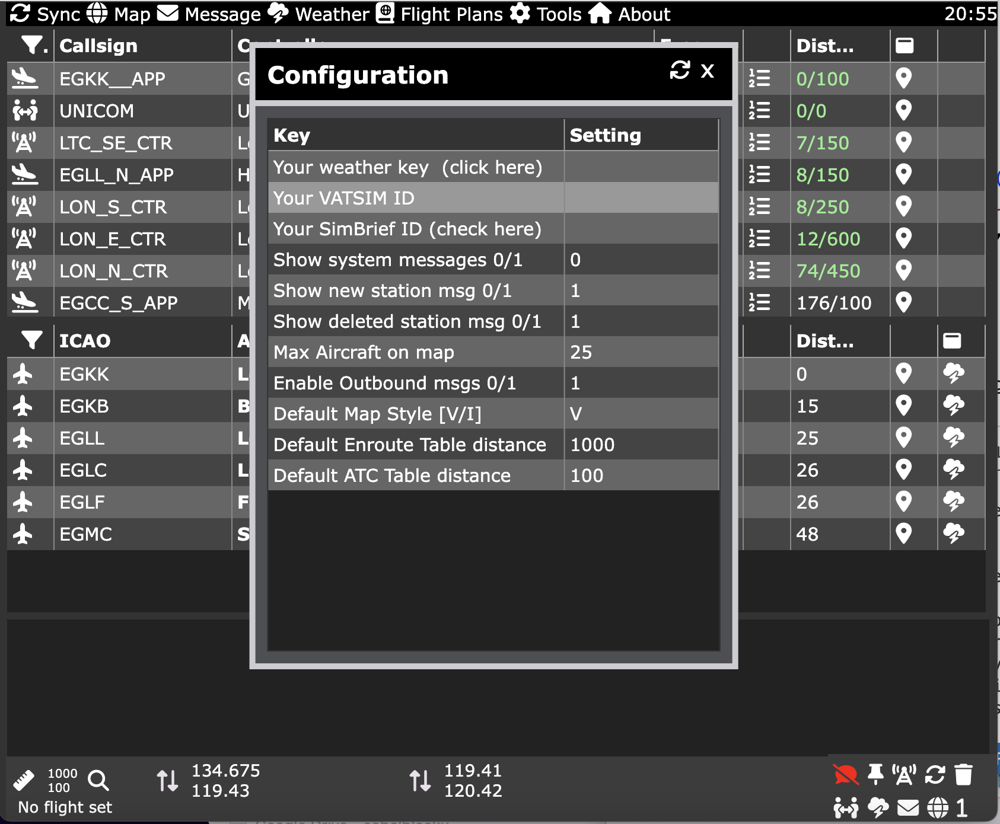
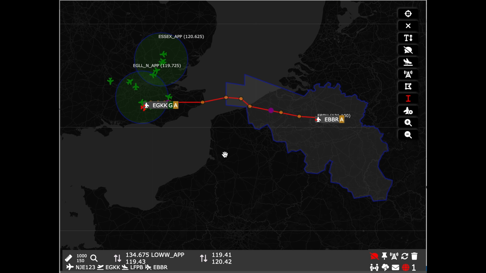
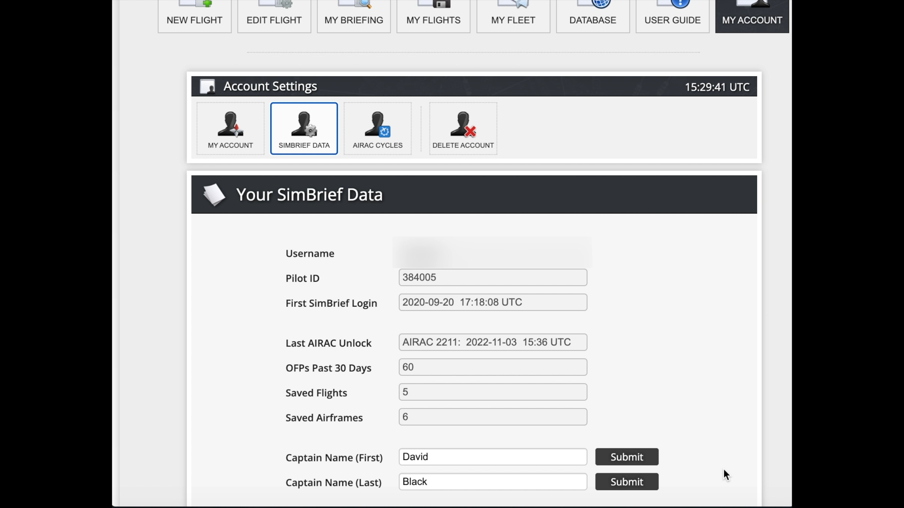
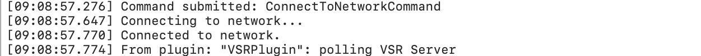
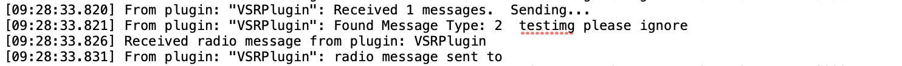

# VSR for VATSIM 

MSFS 2020 toolbar app for VATSIM

Latest release can be download from  <a href="https://github.com/daveblackuk/VSR/releases/tag/VSR"  target="_blank"> Github </a>

<a href="https://www.youtube.com/watch?v=Xp72yo8IUcY"  target="_blank"> 
Click to play promo video </a>

## Description

VSR is a toolbar app for Microsoft Flight Simulator 2020 that allows you to check which air traffic controllers are online when flying on the VATSIM Network. You can easily change to a frequency with a single click, or place a frequency on standby ready to change when requested to by ATC. The app also send & receives messages to and from the VATSIM network.

This app is not associated or endorsed by the VATSIM Network

### Features

</img>
</img>
</img>
</img>
</img>
</img>
</img>
</img>
</img>
</img>
</img>

## Getting Started

VSR consists of three components:

* A server that runs in the background, orchestrating data sources and messages.
* A toolbar app that installs in your community folder and runs in MSFS.
* A dynamic link library (DLL) that enables messaging between VATSIM and VSR.

An optional sound file can be installed under vPilot which makes it easier to hear incoming messages. <a href="https://youtu.be/JVm2Azv1CiQ" target="_blank">(preview)</a>

### Installation 

The install process can either be run through the installer programme, or manually. The installer will:

* Install latest release of the server
* Install latest release of the VSR Toolbar app
* Install latest release of the VSR/vPilot messaging DLL (and check it is installed correctly)
* Install new vPilot inbound message sounds 
* Enable configuration of the server with simBrief, VATSIM and CHECKWX data
* Create an optional desktop icon for the server 

<a href="https://www.youtube.com/watch?v=dQLiLrA36kM&list=PLPLro718J3Ka5t9TzFSH_9cL2-bKV70zh" target="_blank"> Installer Video </a>

### Dependencies
* Microsoft Flight Simulator 2020
* Windows 10 and above
* [vPilot](https://vpilot.rosscarlson.dev/) to connect to VATSIM and relay messages 
* Newtonsoft.json.dll (for messaging) - installed with vPilot
* SimConnect (installed with MSFS)

### The VSR Zip file

Download the latest version from the <a href="https://github.com/daveblackuk/VSR/releases/tag/VSR" target="_blank">github repository</a>

Unzip the file; the directory structure should be as follows:

You can either run the installer, or install manually.

### Automatic installer
#### Installation process

The installer will undertake a number of checks as it proceeds:

* Check the MSFS community folder, it will vary based upon whether MSFS was installed:
    * Via MS Store  
    * Via Steam
    * Via a physical disk
    * Manually 
* Check the versions of the downloaded components
* Check whether you wish to continue or install manually
* Ask you where you wish to install the toolbar app component
  
   The default location is the detected community folder; however you may
   wish to install it elsewhere, for instance if you are using an add-on linker.
   If you answer n then you will need to select a folder manually.

* Ask you where you wish to install the server component. 

   By default this is under the toolbar folder; hwoever you may wish to install it elsewhere. If you answer n then you will need to select a folder manually.

* Check whether an existing configuration exists in the selected server location
* Copy the toolbar app to the selected folder.
* Copy the VSR server to the selected folder.
* Ask you whether you want the new VSR message sound for vPilot installed <a href="https://youtu.be/JVm2Azv1CiQ" target="_blank">(preview)</a>
  
   If you answer yes, then the installer will backup two existing files into a backup directory under vPilot/sounds and copy over the new files.

* Ask you if you wish to create a desktop shortcut to the VSR Server.
* Start vPilot and wait for an incoming message to ensure the DLL is working correctly.
  
* If there are issues, please read the DLL section (below)

#### Virus warnings
Some AV solutions have issues with the installer; 

If this occurs, run the installer as administrator and allow the execution 

### Manual installation

Manual installation is not recommended, however if you wish to copy the files yourself then the following is important:

#### Directories

Copy the vs-radio-toolbar folder to either a custom folder or the community folder for your installation:

Microsoft Store:

` %AppData%\Local\Packages\Microsoft.FlightSimulator_8wekyb3d8bbwe\LocalCache\Packages\Community ` 

Steam:

` %AppData%\Roaming\Microsoft Flight Simulator\Packages\Community` 

Retail disk:

` %AppData%\Local\MSFSPackages\Community` 

Copy the server executable VSR.EXE to a directory of your choice

#### The VSR vPilot DLL

The server integrates with vPilot using a plug -in DLL - this needs to be copied to the vPilot\plugins\ folder, if vPilot has been installed without changes then this can be found under  

` %AppData%\Local\vPilot\Plugins. ` 

Stop and start vPilot, then reconnect to the network. 

If the DLL is correctly installed then the vPilot started message will appear in the message panel in the app; the further message will appear once vPilot is connected to the VATSIM network.

If the messages do not appear then check that correct permissions are set for for the DLL (see below under 
[known issues](#known-issues).

If messaging is not functioning, then please see the [debugging section](#how-to-debug).
  

#### vPilot Sound files 

Copy the sound files to the following directory:

`  %AppData%\Local\vPilot\sounds ` 

### The Metar key
#### Why do you need a key?
 The METAR key is essential for a number of functions within VSR, not only is it used for getting weather updates  other conditional content, such as asking the controller whether they cover your current airport.

#### Obtaining free key
 The METAR key can be obtained free of charge from [www.checkwxapi.com](https://www.checkwxapi.com), this allows you up to 3000 checks per day.

#### Configuring the key in VSR

The METAR key is entered in the configuration screen
Tools->Edit config->Your weather key

### Your VATSIM User ID 

Your vPilot CID, or user ID, is used when you login to VATSIM using vPilot or via the web, it is typically a six digit number.

#### Why do you need it?

VSR uses your CID for two functions:

* Removes your "ghost" aircraft from the map, otherwise you get followed by a green aircraft. 
* Retrieves your flight plan, so you can load the departure, arrival and alternat airports.

#### Configuring the vPilot CID in VSR
The VATSIM CID is entered in the configuration screen
Tools->Edit config->Your VATSIM ID.

### Your SimBrief ID

This tutorial covers all the aspects of SimBrief integration

 <a href="https://www.youtube.com/watch?v=q0iAoEC4zIU" target="_blank">SimBrief VSR Tutorial</a>

#### Why do you need it?

VSR uses SimBrief information to:

 * Import your latest flight plan
 * Filter the airport table with your depature and arrival airports
 * Plot your route on the map
 * Add the airports to the weather menu 
 * Add quick links for the airports for other information

#### Where to find your SimBrief ID

This is found on SimBrief under Account settings->SimBrief data

Note this is your Pilot ID not your username

#### Configuring the SimBrief ID in VSR

The SimBrief ID is entered in the configuration screen
Tools->Edit config->Your SimBrief ID.

## Running the server
### Startup procedure

#### 1st time run or import

If you are running a release greater than 0.8.1.1 for the 1st time, then the server will initialise the configuration in the registry. 

If you ever need to edit the settings by hand then the registry path is:

` HKEY_CURRENT_USER\SOFTWARE\DeltaBravoZulu\VSR `

If you are upgrading from an earlier version, then the server will import your current settings into the registry.

#### Waiting for MSFS

Once the server has checked the registry, it will then wait for the simulator to start. It will then start 3 server processes:

 * The core webserver component on port 1228 (you can check on http://localhost:1228) - Please note that your initial location will be West Africa in the Atlantic at the Equator and Meridian 
 * The vPilot DLL connection for incoming VATSIM messages
 * The vPilot DLL connection for outgoing VATSIM messages

If you are running another copy of the server the servers will fail to load and advise you that there is another copy running. Close the duplicate server window.

Once the server has started, you can start a flight and load the toolbar app from the toolbar clicking the white headphone icon

## Troubleshooting
### Known issues

* If you start a new flight after returning to the main simulator menu, then please restart the server from the config menu to ensure the correct aircraft location is shown in VSR.

* AFTER CTD restart the VSR server. This can be done from U/I using debug menu in left hand header above Airports table. Failure to restart might cause the App from updating frequencies and getting postion updates from Sim. 

* Crash to desktop issues have been reported with the Fenix A320; changing the memory allocations as per <a href="https://kb.fenixsim.com/potential-way-to-help-stop-ctds" target="_blank"> these instructions </a> may resolve this issue. 

* Controllers may appear above the Unicom frequency and on the map at 0 miles distance, this is caused by the VATSIM feed data baing out of sync and is designed to ensure that controllers are always visible irrespective of the feed. This is normally shortlived and disappears with a refresh about a few minutes when the controller is assigned the correct location. 

* If you are not receiving messages from Vatsim, then the DLL may require additional permissions to run; right click on the DLL and ensure that the unblock security check box, if shown, has been checked . Stop and start vPilot, the reconnect to the network. 

• Some icons do not render correctly in MSFS; this is due to limitations in the MSFS internal browser. This due to the style sheets in the tabulator framework used for the tables; it is on the backlog to resolve (if possible).

### How to debug
#### Checking the Toolbar app is being loaded by MSFS

You can check in the simulator to ensure the toolbar app is installed and loaded:

#### Checking that the DLL is being loaded by vPilot

Start debugging in Vpilot by typing .debug into vPilot, connect to the VATSIM network and the should contain the following:

Once connected with a flight started, send a message to the network (no receipient). vPilot will show the message in its interface.

The vPilot debug log will contain:

#### Checking the server is running correctly

Load a browser and navigate to http://locahost:1228. If the server is functioning then the VSR screen will load.

## FAQs

### Why did you develop this?

VSR came about from my own needs, I wanted to fly in VR and use VATSIM, it wasn't easy to get the controller info in the cockpiut.

I also had issues remembering the frequencies, a common issue with single pilot IFR flying in any aircraft. So having a simple click to change facility eased that burden.

### Why do I need to run a server?

The server has the following benefits:

* Reduces the work load on the toolbar app in the sim; thus removing the risk of performance issues such as stuttering.
* Acts as a bridge between the toolbsar app and vPilot DLL
* Removes the need to run this in the cloud, thus incurring costs. We want to keep this as freeware

### Can we have bigger fonts in VR?

The app can be resized and positioned nearer or further from you using the following instructions:

 <a href="https://youtu.be/PnuaL6olY9g" target="_blank">Resizing toolbar apps in VR</a>

### Can you add [insert feature] ?

VSR is designed to facilitate VATSIM flying; a key design principle is not to replicate features found in other software, for instance scribble notepads, navigraph charts integration etc. 

However, always ask over on the Discord. Some great features have come from user suggestions.

I also get usability research from watching Youtube streamers using VSR.

## Authors

* David Black (main server and app)
* Craig Farrell (vPilot plug-in)

## Links

* Discord: https://discord.gg/MJ6fBfYfNR
* GitHub: https://github.com/daveblackuk/VSR

## Acknowledgments

* Craig Farrell for developing the vPilot plug-in
* The [Leaflet](https://leafletjs.com/) map libraries 
* The [Tabulator](http://tabulator.info/) framework
* The [VAT-Spy](https://github.com/vatsimnetwork/vatspy-data-project) data project
* Maximus and others for helping [simplify](https://github.com/bymaximus/msfs2020-toolbar-window-template/issues/22) the MSFS toolbar app environment 
* Ross Carlson's [vPilot project](https://vpilot.rosscarlson.dev/) 
* Last but not least, the amazing group of people who joined and Beta programme and tested this thing until it was good to go !

## Buy me a Coffee or donate via Paypal

Here's a  link for those wishing to use   <a href="https://www.paypal.com/donate/?hosted_button_id=W4LJUKDFRFDBY" target="_blank">PayPal</a>

**Thanks**